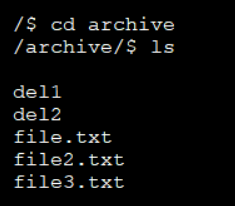
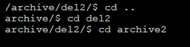
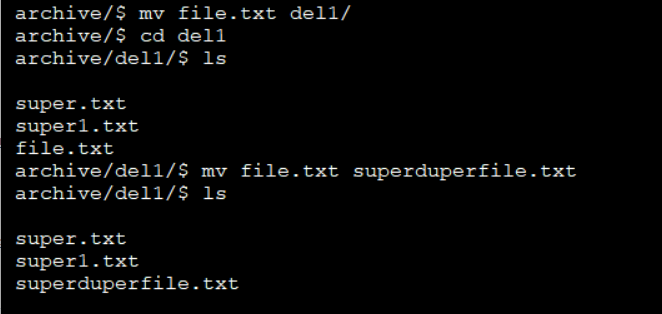
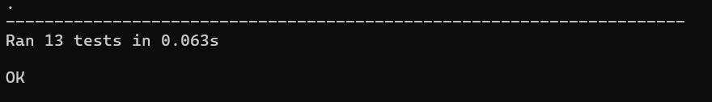

# shell-emulator
Первое домашнее задание по Конфигурационному Управлению

## Постановка задачи

### Задание №1
Разработать эмулятор для языка оболочки ОС. Необходимо сделать работу
эмулятора как можно более похожей на сеанс shell в UNIX-подобной ОС.
Эмулятор должен запускаться из реальной командной строки, а файл с
виртуальной файловой системой не нужно распаковывать у пользователя.
Эмулятор принимает образ виртуальной файловой системы в виде файла формата
zip. Эмулятор должен работать в режиме GUI.
Ключами командной строки задаются:
• Путь к архиву виртуальной файловой системы.
Необходимо поддержать в эмуляторе команды ls, cd и exit, а также
следующие команды:
1. pwd.
2. mv.
Все функции эмулятора должны быть покрыты тестами, а для каждой из
поддерживаемых команд необходимо написать 2 теста.

Для запуска ввести в консоль: 

```python shell_emulator.py "C:\Users\Пользователь\Desktop\конфигурационка\archive.zip"```

Для запуска тестов ввести в консоль: 

```python test_shell_emulator.py```

### Важно!

Для работы программы необходимо создать архив в директории проекта archive.zip

# Эмулятор Shell

## Описание алгоритма

1. **Классы для представления файловой системы:**

    - **VirtualFileSystem**: основной класс, отвечающий за управление виртуальной файловой системой, представленной в виде ZIP-архива. Хранит путь к архиву, текущий рабочий каталог и предоставляет методы для выполнения команд `ls`, `cd`, `pwd`, `mv` и `exit`.

2. **Загрузка виртуальной файловой системы:**

    - **Инициализация VirtualFileSystem**: при создании экземпляра класса `VirtualFileSystem` программа загружает содержимое ZIP-архива в память с помощью `BytesIO` и инициализирует объект `ZipFile` для взаимодействия с архивом. Устанавливается начальный путь как корень (`"/"`).

3. **Выполнение команд:**

    - **Метод `ls`**:
        - Получает список файлов и папок в текущей директории.
        - Итерируется по списку имен файлов в архиве, фильтрует элементы, начинающиеся с текущего пути, и добавляет непосредственные дочерние элементы в результат.
    
    - **Метод `cd`**:
        - Изменяет текущий рабочий каталог.
        - Если путь `".."`, перемещается на уровень вверх.
        - Иначе нормализует и проверяет существование указанного каталога в архиве.
        - Если каталог существует, обновляет текущий путь, иначе выбрасывает `FileNotFoundError`.
    
    - **Метод `pwd`**:
        - Возвращает текущий рабочий каталог.
    
    - **Метод `mv`**:
        - Перемещает или переименовывает файл внутри архивированной файловой системы.
        - Нормализует пути источника и назначения.
        - Проверяет, является ли путь назначения каталогом.
        - Проверяет наличие исходного файла, выбрасывает `FileNotFoundError`, если файл не найден.
        - Создает новый архив в памяти, копирует все файлы, изменяя путь перемещаемого файла.
        - Обновляет архив в памяти и сохраняет изменения обратно на диск.
    
    - **Метод `exit`**:
        - Закрывает архив и завершает работу программы.

4. **Класс ShellGUI:**

    Основной класс, отвечающий за интерфейс приложения и логику командной оболочки.

    - **Метод `__init__`**:
        - Инициализирует главное окно Tkinter с черным фоном и устанавливает размер окна.
        - Создает область вывода (`ScrolledText`) для отображения результатов команд.
        - Создает поле ввода для ввода команд пользователем и привязывает нажатие клавиши Enter к выполнению команды.
        - Отображает начальное приглашение командной строки.
    
    - **Метод `display_prompt`**:
        - Обновляет текст приглашения командной строки, отображая текущий путь.
    
    - **Метод `execute_command`**:
        - Обрабатывает вводимые пользователем команды.
        - Разбирает команду и вызывает соответствующие методы `VirtualFileSystem`.
        - Отображает результаты выполнения команды или сообщения об ошибках.
    
    - **Метод `append_output`**:
        - Добавляет текст в область вывода, обеспечивая ее только для чтения и автоматическую прокрутку.
    
    - **Метод `run`**:
        - Запускает главный цикл Tkinter, делая окно отзывчивым и интерактивным.

5. **Запуск программы:**

    Выполнение происходит в блоке `if __name__ == '__main__'`, который:
    
    - Парсит аргументы командной строки, ожидая путь к ZIP-архиву виртуальной файловой системы.
    - Создает экземпляр `VirtualFileSystem` с указанным архивом.
    - Инициализирует и запускает GUI через экземпляр `ShellGUI`.

### Как работает программа

1. **Запуск приложения**: Программа запускается из командной строки с указанием пути к ZIP-архиву виртуальной файловой системы.
   
2. **Загрузка файловой системы**: Класс `VirtualFileSystem` загружает содержимое ZIP-архива в память и инициализирует структуру каталогов.
   
3. **Инициализация GUI**: Класс `ShellGUI` создает графический интерфейс с областью вывода и полем ввода для команд.
   
4. **Ввод команд**: Пользователь вводит команды (`ls`, `cd`, `pwd`, `mv`, `exit`) в поле ввода и нажимает Enter.
   
5. **Обработка команд**: Введенные команды передаются в `VirtualFileSystem` для выполнения соответствующих операций.
   
6. **Отображение результатов**: Результаты выполнения команд отображаются в области вывода. При возникновении ошибок выводятся сообщения об ошибках.
   
7. **Завершение работы**: Команда `exit` закрывает архив и завершает работу программы.

## Тестирование программы

### Запуск тестов

Тесты разработаны с использованием модуля `unittest` и проверяют функциональность класса `VirtualFileSystem`. Для запуска тестов выполните следующую команду:

```bash
python test_shell_emulator.py
```

Если все тесты прошли успешно, вы увидите сообщение:

```
.............
----------------------------------------------------------------------
Ran 13 tests in 0.234s

OK
```


#### Тестирование команды `ls`



#### Тестирование команды `cd`



#### Тестирование команды `mv`



#### Тестирование команды `exit`


#### Результаты unittest



